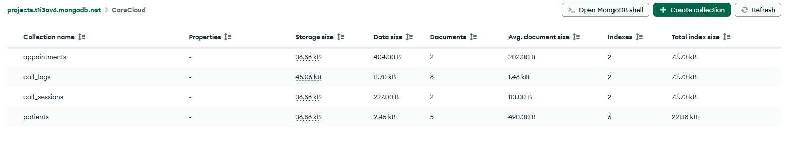

# CareCloud — Voice AI Patient Registration System

> A production-oriented voice AI agent that answers a real U.S. phone number, conversationally collects patient demographics, confirms the data, and persists it to a database via a clean REST API.

Built as a take-home technical assessment for a **Voice AI / Conversational AI Engineer** role.

---

## Live Demo

| Resource              | URL / Number                                      |
|-----------------------|---------------------------------------------------|
| **Phone Number**      | **+1 (234) 404-2250**                             |
| **REST API**          | https://carecloud-backend.onrender.com            |
| **Dashboard**         | https://carecloud-pi.vercel.app                   |
| **Repository**        | https://github.com/mshayan-ags/Voice-AI-Agent-Patient-Registration-System |

**Try it**: Call the number and speak naturally. You can register a new patient, update an existing one (by phone number), or schedule a mock appointment.

---

## Screenshots

| | |
|---|---|
|  |  |
|  |  |
|  |  |
|  |  |

---

## Features

### Core Requirements
- Real dialable U.S. phone number (Vapi)
- Fully natural conversational flow (not rigid IVR)
- LLM-powered understanding of varied phrasing, corrections, and out-of-order answers
- Full read-back + verbal confirmation before any write
- Server-side validation with specific re-prompts for invalid data
- Complete patient demographic data model (required + optional fields)
- Persistent MongoDB storage (survives restarts)
- Full REST API with the exact endpoints and response envelope required by the assessment
- Soft-delete support
- Clean separation of concerns (telephony ↔ API ↔ service ↔ data)

### Bonuses Implemented
- **Duplicate detection** — recognizes returning callers by phone number and offers to update
- **Appointment scheduling** — offers and books mock first appointments
- **Call transcripts & analysis** — every call (successful or not) is logged with transcript, summary, structured data, and success evaluation
- **Web dashboard** — patients, appointments, call logs, and patient detail views
- **Automated tests** — 35+ unit/integration tests covering validators, API, and Vapi tools

---

## Architecture

```
Caller (PSTN)
      │
      ▼
┌─────────────────────────────────────────────────────────────┐
│  Vapi                                                       │
│  • Telephony + number provisioning                          │
│  • Deepgram STT (default)                                   │
│  • ElevenLabs TTS (primary + fallback voice)                │
│  • OpenRouter LLM (openai/gpt-4o-mini)                      │
│  • Function / tool calling                                  │
└──────────────────────────┬──────────────────────────────────┘
                           │ HTTPS webhooks
                           │ (tool-calls + end-of-call-report)
                           ▼
┌─────────────────────────────────────────────────────────────┐
│  FastAPI Backend (Render)                                   │
│  ├── /api          → HTTP concerns + {data, error} envelope │
│  ├── /services     → Business logic (shared by API + tools) │
│  ├── /models       → Pydantic schemas + validation          │
│  └── /db           → MongoDB access (Motor)                 │
└──────────────────────────┬──────────────────────────────────┘
                           │
                           ▼
                  MongoDB Atlas
                  (patients, appointments,
                   call_logs, call_sessions)
                           │
                           ▼
              Next.js Dashboard (Vercel)
              patients • appointments • call logs
```

**Design principles**
- Telephony layer knows nothing about MongoDB or HTTP status codes.
- Service layer is shared — the same business logic runs whether called from REST or from a Vapi tool.
- All validation lives in Pydantic models (server-side is the source of truth).
- Soft deletes only (`deleted_at`).

---

## Data Model

| Field                     | Type      | Required | Validation / Notes                          |
|---------------------------|-----------|----------|---------------------------------------------|
| `patient_id`              | UUID      | Auto     | Generated on create                         |
| `first_name`              | string    | Yes      | 1–50 chars, letters + hyphens/apostrophes   |
| `last_name`               | string    | Yes      | same as above                               |
| `date_of_birth`           | date      | Yes      | Not in the future, MM/DD/YYYY               |
| `sex`                     | enum      | Yes      | Male, Female, Other, Decline to Answer      |
| `phone_number`            | string    | Yes      | Valid U.S. 10-digit (normalized)            |
| `email`                   | string    | No       | Valid email format                          |
| `address_line_1`          | string    | Yes      | Street address                              |
| `address_line_2`          | string    | No       | Apt / Suite / Unit                          |
| `city`                    | string    | Yes      | 1–100 characters                            |
| `state`                   | string    | Yes      | Valid 2-letter U.S. state abbreviation      |
| `zip_code`                | string    | Yes      | 5-digit or ZIP+4                            |
| `insurance_provider`      | string    | No       |                                             |
| `insurance_member_id`     | string    | No       | Alphanumeric (hyphens allowed)              |
| `preferred_language`      | string    | No       | Default: `"English"`                        |
| `emergency_contact_name`  | string    | No       |                                             |
| `emergency_contact_phone` | string    | No       | Valid U.S. 10-digit                         |
| `created_at`              | datetime  | Auto     | UTC                                         |
| `updated_at`              | datetime  | Auto     | UTC                                         |
| `deleted_at`              | datetime  | —        | Soft-delete timestamp                       |

The voice agent collects all required fields, then offers optional fields in a single opt-in question.

---

## REST API

Base URL: `https://carecloud-backend.onrender.com`

All responses use the envelope:
```json
{ "data": { ... }, "error": null }
```
or on error:
```json
{ "data": null, "error": { "code": "...", "message": "...", "field": "..." } }
```

| Method   | Endpoint                          | Description                                      |
|----------|-----------------------------------|--------------------------------------------------|
| `GET`    | `/patients`                       | List patients. Query params: `last_name`, `date_of_birth`, `phone_number` |
| `GET`    | `/patients/{id}`                  | Get single patient by UUID                       |
| `POST`   | `/patients`                       | Create patient (201). 409 on duplicate phone     |
| `PUT`    | `/patients/{id}`                  | Partial update                                   |
| `DELETE` | `/patients/{id}`                  | Soft-delete (`deleted_at` set)                   |
| `GET`    | `/appointments/slots`             | Available mock slots                             |
| `GET`    | `/appointments`                   | List appointments (optional `patient_id`)        |
| `POST`   | `/appointments`                   | Book a slot                                      |
| `GET`    | `/call-logs`                      | Call transcripts & analysis                      |
| `POST`   | `/vapi/tool-calls`                | Vapi webhook (requires `x-vapi-secret`)          |

---

## Tech Stack & Rationale

| Layer                    | Technology                          | Why chosen                                                                 |
|--------------------------|-------------------------------------|----------------------------------------------------------------------------|
| Telephony + Orchestration| **Vapi**                            | Real number + STT/TTS + tool calling with almost zero custom telephony code |
| LLM                      | **OpenRouter** (`openai/gpt-4o-mini`) | Model-agnostic - a free-tier reasoning model was tried and reverted after it leaked chain-of-thought into real calls (see Known Limitations); costs fractions of a cent/call |
| Voice (TTS)              | **ElevenLabs** (`eleven_flash_v2_5`)| Natural voice + low latency; fallback voice configured                     |
| Backend                  | **FastAPI + Pydantic + Motor**      | Async, excellent validation, shared models for API + tools                 |
| Database                 | **MongoDB Atlas** (free M0)         | Flexible schema for mostly-optional fields                                 |
| Hosting (API)            | **Render** (free)                   | Simple Git-based deploy                                                    |
| Hosting (Dashboard)      | **Vercel** (static export)          | Zero-config static hosting                                                 |
| Frontend                 | **Next.js** (App Router)            | Clean, fast dashboard                                                      |

---

## Repository Structure

```
.
├── backend/
│   ├── app/
│   │   ├── api/           # REST routes + Vapi webhook
│   │   ├── core/          # config, logging
│   │   ├── db/            # Mongo connection
│   │   ├── models/        # Pydantic schemas
│   │   ├── services/      # Business logic (shared)
│   │   └── utils/         # validators
│   ├── scripts/           # seed data
│   ├── tests/             # 35+ tests
│   └── requirements.txt
├── vapi/
│   ├── system_prompt.md   # Source of truth for the agent prompt
│   ├── tools.py           # Function tool definitions
│   └── setup_assistant.py # Creates / updates the Vapi assistant
├── frontend/              # Next.js dashboard
└── docs/                  # Screenshots referenced above
```

---

## Setup Instructions

### 1. MongoDB Atlas
1. Create a free M0 cluster.
2. Create a database user.
3. Allow network access from `0.0.0.0/0` (or your IPs).
4. Copy the connection string.

### 2. Backend (local)

```bash
cd backend
python -m venv .venv
source .venv/bin/activate          # Windows: .venv\Scripts\activate
pip install -r requirements.txt
cp .env.example .env               # fill in values
uvicorn app.main:app --port 8000
```

Optional seed data:
```bash
python -m scripts.seed_data
```

Run tests (no real Mongo needed):
```bash
pytest -q
```

For local Vapi testing, expose with ngrok:
```bash
ngrok http 8000
```

### 3. Vapi Assistant

1. Create accounts at [vapi.ai](https://vapi.ai), [openrouter.ai](https://openrouter.ai), and [elevenlabs.io](https://elevenlabs.io).
2. Add OpenRouter + ElevenLabs credentials inside Vapi (Integrations or API).
3. Pick real voice IDs from *your* ElevenLabs library (`GET /v1/voices`).
4. Configure `vapi/.env`.
5. Create the assistant:
   ```bash
   cd vapi
   pip install -r requirements.txt
   python setup_assistant.py create
   ```
6. Provision a phone number (note: Vapi requires a card on file even for free numbers):
   ```bash
   python setup_assistant.py phone <assistant_id>
   ```
   Or create the number manually in the Vapi dashboard and attach it.

The system prompt and tools live in the repo (`system_prompt.md` + `tools.py`). Re-sync anytime with:
```bash
python setup_assistant.py update <assistant_id>
```

### 4. Dashboard (optional)

```bash
cd frontend
npm install
cp .env.local.example .env.local   # set NEXT_PUBLIC_API_BASE_URL
npm run dev
```

Deploy to Vercel:
```bash
npx vercel --prod
```
Then set `NEXT_PUBLIC_API_BASE_URL` in the Vercel project settings and redeploy.

---

## Environment Variables

| Location            | Variable                      | Required | Description                                      |
|---------------------|-------------------------------|----------|--------------------------------------------------|
| `backend/.env`      | `MONGODB_URI`                 | Yes      | Atlas connection string                          |
|                     | `MONGODB_DB_NAME`             | No       | Default: `carecloud`                             |
|                     | `VAPI_WEBHOOK_SECRET`         | Yes      | Shared secret for webhook auth                   |
|                     | `CORS_ORIGINS`                | No       | Comma-separated allowed origins                  |
| `vapi/.env`         | `VAPI_API_KEY`                | Yes      | Vapi private key                                 |
|                     | `BACKEND_URL`                 | Yes      | Public HTTPS URL of the backend                  |
|                     | `VAPI_WEBHOOK_SECRET`         | Yes      | Must match backend                               |
|                     | `OPENROUTER_API_KEY`          | Yes      |                                                  |
|                     | `OPENROUTER_MODEL`            | No       | Default `openai/gpt-4o-mini` (must support tool calling) |
|                     | `ELEVENLABS_API_KEY`          | Yes      |                                                  |
|                     | `ELEVENLABS_VOICE_ID`         | Yes      | Must exist in your ElevenLabs account            |
|                     | `ELEVENLABS_FALLBACK_VOICE_ID`| Recommended | Second voice for resilience                   |
| `frontend/.env.local` | `NEXT_PUBLIC_API_BASE_URL`  | Yes      | Backend base URL                                 |

No secrets are hardcoded. All `.env` files are gitignored.

---

## Prompt Engineering Notes

The system prompt (`vapi/system_prompt.md`) was iteratively improved from real call transcripts:

- Phone number is collected **second** (right after name) so duplicate detection can fire early.
- Duplicate check is a **hard blocking rule**, not a soft suggestion.
- Full confirmation happens **only once**, right before save (no per-field confirmation spam).
- Agent is instructed to end the call itself after the goodbye line (`endCallPhrases` as backstop).
- Invalid data triggers a targeted re-prompt for that field only.
- “Start over” is supported.
- The agent never mentions tools, APIs, or databases to the caller.

---

## Security

- All secrets via environment variables.
- Vapi webhook protected by shared secret header.
- Full server-side validation (Pydantic).
- Regex escaping on search queries.
- Soft-delete only.
- CORS allow-list.
- **Not HIPAA compliant** — this is an assessment project; do not store real patient data.

---

## Known Limitations & Trade-offs

| Issue | Mitigation / Notes |
|-------|--------------------|
| Free-tier reasoning models can leak chain-of-thought into the call | Tried `nvidia/nemotron-3-super-120b-a12b:free`; a real call surfaced it audibly reasoning out loud instead of replying cleanly. OpenRouter's `reasoning: {enabled: false}` param fixes this in direct API calls but Vapi's generic OpenRouter integration doesn't pass it through - reverted to `openai/gpt-4o-mini` (fractions of a cent/call) rather than risk it recurring live |
| `endCallPhrases` can match the first message, not just the goodbye | Hit this for real: "thanks for calling" was in both the phrase list and the greeting, so Vapi force-ended every call right after it played. Fixed by keeping only exclusively-goodbye phrases ("have a great day") and keeping the first message free of any goodbye-adjacent wording |
| Vapi requires card for any number | Documented; create number manually if needed |
| ElevenLabs voice ID instability | Always pick IDs from *your* account + fallback voice |
| STT errors (e.g. “sex” → “six”) | Agent recovers conversationally |
| ~2.5 s turn latency | `eleven_flash_v2_5` chosen for speed |
| Render free-tier cold starts | First tool call after idle can be slow |
| No idempotency keys on writes | Agent retries conversationally once |
| Auto-deploy on Render limited | Manual deploy or connect GitHub App |

---

## Testing the System

1. **Call** `+1 (234) 404-2250`
2. Speak naturally as a new patient.
3. Try:
   - Invalid date of birth or incomplete phone number
   - Correcting a field mid-flow
   - Using a phone number that already exists (triggers update flow)
   - Opting into insurance / emergency contact
   - Scheduling an appointment
4. Verify the record appears in:
   - `GET /patients`
   - The dashboard
5. Check call logs for transcript + analysis.

Local tests:
```bash
cd backend && pytest -q
```

---

## Evaluation Criteria Mapping

| Criterion (20% each)       | How this project addresses it |
|----------------------------|-------------------------------|
| Working System             | Live phone + live API + persistence across calls |
| Conversational Quality     | Natural prompt, correction handling, confirmation, edge-case recovery |
| Technical Architecture     | Clear layers, shared service logic, proper schema, RESTful API |
| Code Quality & Docs        | Clean structure, comprehensive README, documented prompt, tests |
| Edge Cases & Resilience    | Validation, soft-delete, webhook auth, graceful tool failures, start-over support |

---

## Next Steps (if more time were available)

- Add authentication / API keys on the REST endpoints
- Idempotency keys on create/update
- Cross-provider TTS fallback
- Multi-language support
- Real appointment calendar integration
- HIPAA-oriented hardening (encryption, audit logs, BAAs)
- Load testing and latency optimization of the system prompt

---

## License

This project was created for a technical assessment. Feel free to use it as a reference or starting point.

---

**Built with care under time pressure.**  
We would rather see a simple system that works flawlessly than an over-engineered one that crashes on the first call.

